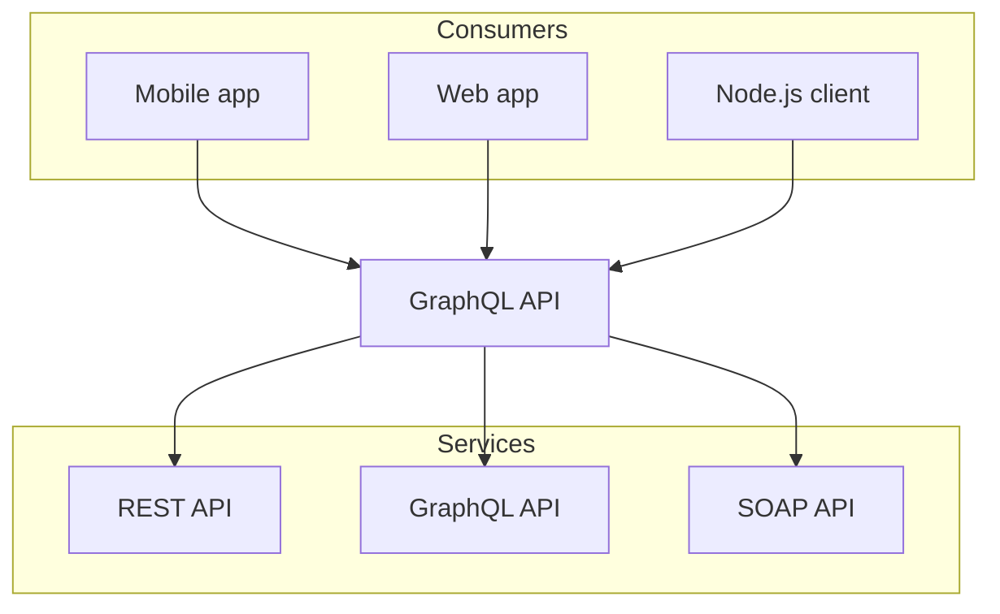

# demo

this site is built with [Nextra](https://nextra.site), which i am a huge fan of. Here are some of the features i like:

```js filename="demo.js" {3} copy
let a = 1;

console.log(a);
```

## component

import { useState } from 'react'

{/* Import CSS modules */}
import styles from '../components/counters.module.css'

export const Counter = () => {
  const [count, setCount] = useState(0);
  return (
    <div>
      <button onClick={() => setCount(count + 1)} className={styles.counter}>Clicked {count} times</button>
    </div>
  );
};

<Counter/>

## external component

import Counters from '../components/counters'

<Counters />

## latex

The **Pythagorean equation**: $a=\sqrt{b^2 + c^2}$.

## mermaid



## gfm syntax for tables

| left   | center | right |
| :----- | :----: | ----: |
| foo    |  bar   |   baz |
| banana | apple  |  kiwi |

## html literal tables

<table>
  <thead>
    <tr>
      <th>left</th>
      <th align="center">center</th>
      <th align="right">right</th>
    </tr>
  </thead>
  <tbody>
    <tr>
      <td>foo</td>
      <td align="center">bar</td>
      <td align="right">baz</td>
    </tr>
    <tr>
      <td>banana</td>
      <td align="center">apple</td>
      <td align="right">kiwi</td>
    </tr>
  </tbody>
</table>

## dynaminc tables

<table>
  <thead>
    <tr>
      <th>Country</th>
      <th>Flag</th>
    </tr>
  </thead>
  <tbody>
    {[
      { country: 'France', flag: '🇫🇷' },
      { country: 'Ukraine', flag: '🇺🇦' }
    ].map(item => (
      <tr key={item.country}>
        <td>{item.country}</td>
        <td>{item.flag}</td>
      </tr>
    ))}
  </tbody>
</table>

## tabs

import { Tabs, Tab } from 'nextra/components'
 
<Tabs items={['pnpm', 'npm', 'yarn']} defaultIndex="3">
  <Tab>**pnpm**: Fast, disk space efficient package manager.</Tab>
  <Tab>**npm** is a package manager for the JavaScript programming language.</Tab>
  <Tab>**Yarn** is a software packaging system.</Tab>
</Tabs>

## steps

import { Steps } from 'nextra/components'
 
<Steps>
### step 1
 
Contents for step 1.
 
### step 2
 
Contents for step 2.
</Steps>

## file tree component

import { FileTree } from 'nextra/components'
 
<FileTree>
  <FileTree.Folder name="pages" defaultOpen>
    <FileTree.File name="_meta.json" />
    <FileTree.File name="contact.md" />
    <FileTree.File name="index.mdx" />
    <FileTree.Folder name="about">
      <FileTree.File name="_meta.json" />
      <FileTree.File name="legal.md" />
      <FileTree.File name="index.mdx" />
    </FileTree.Folder>
  </FileTree.Folder>
</FileTree>

